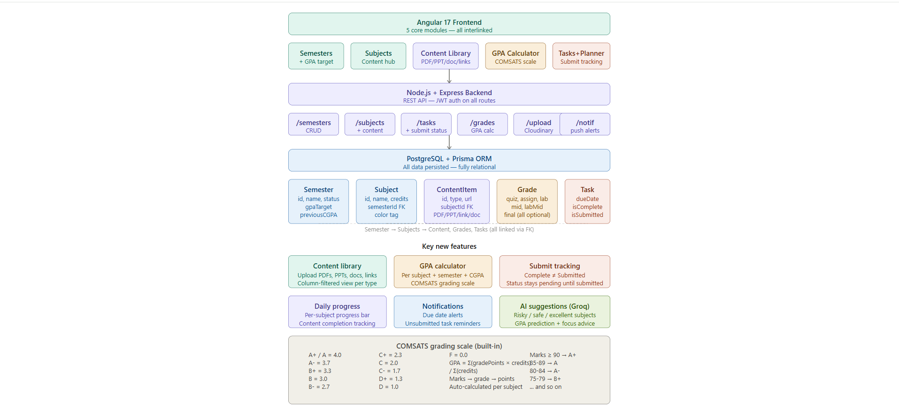

<p align="center">
  
</p>

<h1 align="center">🎓 UniTrack — Student Academic Management System</h1>

<p align="center">
  <strong>Track semesters · manage subjects · calculate GPA · get AI study advice</strong>
</p>

<p align="center">
  <a href="https://uni-tracker-students-2dfc.vercel.app/login">🌐 Live App</a> &nbsp;·&nbsp;
  <a href="https://uni-tracker-students.vercel.app">⚙️ Backend API</a> &nbsp;·&nbsp;
  <a href="#demo-credentials">🔑 Demo Login</a>
</p>

---

## 📸 Architecture

<p align="center">
  
</p>

---

## ✨ Features

| Feature | Description |
|---------|-------------|
| **Semester Management** | Create semesters, set GPA targets, mark as current |
| **Subject Tracking** | Add subjects per semester with credit hours |
| **Content Library** | Upload PDFs, PPTs, docs, links — mark as complete |
| **GPA Calculator** | COMSATS grading scale — quizzes, assignments, mids, finals |
| **CGPA Dashboard** | Semester-wise GPA breakdown with animated rings |
| **Task Manager** | Create tasks, mark complete, then submit separately |
| **Progress Tracking** | Per-subject completion percentages and stats |
| **Smart Notifications** | Due-date alerts, unsubmitted task reminders |
| **AI Study Insights** | Groq-powered advice — risk assessment per subject |
| **Study Planner** | AI-generated study schedule based on workload |

---

## 🛠️ Tech Stack

| Layer | Technology |
|-------|-----------|
| **Frontend** | Angular 17 · TypeScript · CSS Variables |
| **Backend** | Node.js · Express 5 · REST API |
| **Database** | PostgreSQL (Neon) · Prisma ORM |
| **AI** | Groq (LLaMA 3) |
| **Storage** | Cloudinary |
| **Auth** | JWT (JSON Web Tokens) |
| **Hosting** | Vercel (both frontend & backend) |

---

## 🎬 Demo

> **Watch the full walkthrough:** [▶️ UniTrack Demo Video](https://drive.google.com/file/d/1LHo-E9f4lTjqAuCARPa6dliFDLtuSxpc/view?usp=sharing)

---

## 🔑 Credentials

> **Live URL:** [uni-tracker-students-2dfc.vercel.app](https://uni-tracker-students-2dfc.vercel.app/login)

| Field | Value |
|-------|-------|
| Email | `rashfaq00@gmail.com` |
| Password | `123456` |

---

## 📂 Project Structure

```
uni-tracker-Students-/
├── backend/
│   ├── index.js                  # Express entry point
│   ├── prisma/schema.prisma      # Database schema
│   ├── src/
│   │   ├── controllers/          # Business logic
│   │   │   ├── auth.controller.js
│   │   │   ├── semester.controller.js
│   │   │   ├── subject.controller.js
│   │   │   ├── task.controller.js
│   │   │   ├── grade.controller.js
│   │   │   ├── content.controller.js
│   │   │   ├── notification.controller.js
│   │   │   ├── progress.controller.js
│   │   │   └── ai.controller.js
│   │   ├── routes/               # API endpoints
│   │   ├── middleware/            # Auth & error handling
│   │   └── utils/                # Prisma client
│   └── vercel.json
├── frontend/
│   ├── src/app/
│   │   ├── core/services/        # API services
│   │   ├── features/             # Page components
│   │   │   ├── dashboard/
│   │   │   ├── semesters/
│   │   │   ├── subjects/
│   │   │   ├── tasks/
│   │   │   ├── gpa-dashboard/
│   │   │   └── study-planner/
│   │   └── layouts/              # Main & auth layouts
│   └── vercel.json
└── docs/
    ├── banner.png
    └── architecture.png
```

---

## 🚀 API Endpoints

| Method | Endpoint | Description |
|--------|----------|-------------|
| `POST` | `/api/auth/register` | Register new user |
| `POST` | `/api/auth/login` | Login & get JWT |
| `GET/POST` | `/api/semesters` | CRUD semesters |
| `GET/POST` | `/api/subjects` | CRUD subjects |
| `GET/POST` | `/api/tasks` | CRUD tasks |
| `PATCH` | `/api/tasks/:id/submit` | Submit a completed task |
| `GET/PUT` | `/api/grades/subject/:id` | View/save grades |
| `GET` | `/api/grades/semester/:id/gpa` | Semester GPA |
| `GET` | `/api/grades/cgpa` | Cumulative GPA |
| `GET/POST` | `/api/content/subject/:id` | Content library |
| `GET` | `/api/progress/:id` | Subject progress |
| `GET` | `/api/notifications` | Smart notifications |
| `POST` | `/api/ai/gpa-advice` | AI study insights |

---

## 🏃 Run Locally

```bash
# Backend
cd backend
npm install
npx prisma generate
node index.js            # → http://localhost:3000

# Frontend
cd frontend
npm install
ng serve                 # → http://localhost:4200
```

> Create a `.env` file in `backend/` with: `DATABASE_URL`, `JWT_SECRET`, `CLOUDINARY_CLOUD_NAME`, `CLOUDINARY_API_KEY`, `CLOUDINARY_API_SECRET`, `GROQ_API_KEY`

---

## 👩‍💻 Author

**Rabia Ashfaq** — FA23-BSE-074
COMSATS University Islamabad

---

<p align="center">
  Built with ❤️ using Angular + Node.js + Prisma + Groq AI
</p>